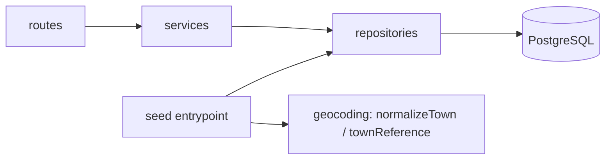

# Architecture Spine — Customer Distance API

## Design Paradigm

Light layered architecture: HTTP route/handler → application/service → data-access/repository → PostgreSQL, plus a standalone seed entrypoint that bypasses the HTTP/service layers but reuses the data-access and geocoding layers.

| Layer | Directory |
| --- | --- |
| HTTP / route | `src/routes/` |
| Application / service | `src/services/` |
| Data-access / repository | `src/repositories/` |
| Shared DB connection | `src/db/` (Pool module) |
| Offline geocoding (seed-only) | `src/geocoding/` (`normalizeTown.ts`, `townReference.ts`) |
| Config | `src/config/` (`env.ts`) |
| Cross-cutting | `src/middleware/` (error handling) |
| App wiring vs. binding | `src/app.ts` (unbound app) / `src/server.ts` (listen) |
| Standalone seed entrypoint | `src/seed.ts` |

## Invariants & Rules

### AD-1 — Layering and dependency direction

- **Binds:** all FRs (FR-1–FR-14); primarily FR-6, FR-7, FR-8
- **Prevents:** domain logic (Haversine calculation, rounding, deterministic sort) leaking into route handlers; the repository layer accumulating business logic; seed and API using divergent DB access paths
- **Rule:** Route handlers perform HTTP I/O only and call service functions only. Service functions perform `distanceKm` calculation, rounding, and sorting, and call repository functions only. Repository functions are the only place SQL is executed, and are limited to DB I/O and row-to-domain mapping (must not contain Haversine or sort logic). Dependency direction is one-way. [ADOPTED]



### AD-2 — Parameterized queries mandatory

- **Binds:** FR-2, FR-6, FR-7
- **Prevents:** SQL injection and query breakage from unescaped values (e.g. the seed value `Niamh O'Brien`, which contains an apostrophe) via string concatenation
- **Rule:** Every SQL statement carrying a dynamic value (seed upserts, any future parameterized filters) must use parameter binding / prepared statements; string concatenation of values into SQL is forbidden. Static, parameter-free `SELECT` statements (e.g. `SELECT COUNT(*) FROM customers`, `SELECT * FROM customers` with no `WHERE` clause) are exempt from an artificial placeholder requirement. `addendum.md` is updated in lockstep with this exemption so the source constraint and the spine never diverge. [ADOPTED]

### AD-3 — Single shared Pool module

- **Binds:** FR-1, FR-2, FR-6, FR-7, FR-11
- **Prevents:** API, seed, and migrations each opening independent or inconsistent DB connections/pools
- **Rule:** Exactly one module (`src/db/pool.ts`) constructs and exports the `pg` `Pool`. All repository code and the seed entrypoint obtain their DB connection exclusively from this module. [ADOPTED]

### AD-4 — App/server separation for testability

- **Binds:** FR-11
- **Prevents:** integration tests being unable to exercise the Express app without binding a live network port
- **Rule:** Express app construction (`src/app.ts`) is separated from `server.listen()` (`src/server.ts`). `app.ts` exports an unbound, importable Express app usable directly by integration tests. [ADOPTED]

### AD-5 — Seed reuses the repository/data-access layer

- **Binds:** FR-2, FR-3
- **Prevents:** the seed script and the API implementing divergent or duplicated SQL against the same table
- **Rule:** The seed entrypoint (`src/seed.ts`) is a standalone application entrypoint, not routed through the HTTP/service layers, but MUST call the same repository functions (parameterized upsert) as the API, and reuse `src/geocoding/normalizeTown.ts` and `townReference.ts` for town-to-coordinate assignment. The upsert is `ON CONFLICT (name, telepules) DO UPDATE SET lat, lon, budget, note, country_code = EXCLUDED.*` — re-seeding with edited source data refreshes the existing row's mutable columns, never `DO NOTHING`. [ADOPTED]

### AD-6 — Pure Haversine function

- **Binds:** FR-8, FR-9
- **Prevents:** the distance calculation acquiring a DB or HTTP dependency that would block isolated unit testing
- **Rule:** The Haversine function (`src/services/haversine.ts`) takes coordinates as plain arguments and returns a plain number or `null`; it has no DB client, HTTP, or I/O dependency of any kind. [ADOPTED]

### AD-7 — Versioned, rollback-capable migrations

- **Binds:** FR-1
- **Prevents:** schema drift and irreversible schema changes; re-running migrations causing errors or duplicate schema elements
- **Rule:** Schema changes are expressed as `node-pg-migrate` versioned migrations with explicit `up` and `down` functions; migrations are safe to re-run (no error, no duplicate schema elements) and reversible. The initial migration MUST create the `customers` table with the `UNIQUE(name, telepules)` constraint and the two `lat`/`lon` `CHECK` constraints exactly as specified in Structural Seed — these are schema-level invariants, not merely illustrative, and AD-5's upsert depends on the `UNIQUE(name, telepules)` constraint existing. Migration files use `node-pg-migrate`'s default timestamp-prefixed naming (via `node-pg-migrate create <name>`), never hand-authored sequence numbers, to avoid numbering collisions. [ADOPTED]

### AD-8 — Centralized error handling, fixed error shape, no leaked internals

- **Binds:** FR-6, FR-7, FR-11
- **Prevents:** the two endpoints returning differently-shaped error bodies, or leaking SQL text, connection strings, stack traces, or secrets to the client
- **Rule:** A single centralized Express 5 error-handling middleware handles all unexpected/DB errors (no per-route try/catch for this purpose). The client response on such errors is always `{"error":{"message":"Internal server error"}}` with HTTP 500, and never contains raw SQL error text, connection strings, stack traces, or DB/env secrets. The actual error is logged server-side via `console.error` with context. No custom error-class hierarchy or error-code taxonomy. [ADOPTED]

### AD-9 — Config fail-fast; test-DB isolation

- **Binds:** FR-11, FR-12, FR-14
- **Prevents:** the app starting with missing/invalid config and failing unpredictably later; integration tests silently running against, and mutating, the dev database
- **Rule:** `src/config/env.ts` is the single place env vars are read (`DATABASE_URL`, `TEST_DATABASE_URL`, `PORT`). It validates required values and fails fast with a clear error message on missing/invalid config; no hardcoded passwords. Integration tests must use `TEST_DATABASE_URL` and must fail-stop (never silently fall back to `DATABASE_URL`) if it is unset. Topology: a single `postgres:18` Docker Compose service hosts two logical databases — `customer_distance` (dev, `DATABASE_URL`) and `customer_distance_test` (`TEST_DATABASE_URL`) — same container/instance, different database name; no second container is needed at this scale. [ADOPTED]

### AD-10 — No DI framework, ORM, or complex domain layer

- **Binds:** all FRs (architectural scale constraint)
- **Prevents:** over-engineering the layering in AD-1 into abstraction (DI containers, ORM entity mapping, a rich domain model) disproportionate to a 15-row homework-scale service
- **Rule:** No dependency-injection framework/container, no ORM/query-builder (raw parameterized SQL via `pg` only), and no domain layer beyond the plain service/repository functions described in AD-1. [ADOPTED]

### AD-11 — PostgreSQL MCP dev-tooling configuration

- **Binds:** FR-13
- **Prevents:** ad-hoc, undocumented MCP setup that varies per developer machine; a committed secret in MCP config
- **Rule:** The official `@modelcontextprotocol/server-postgres` package is configured as the Postgres MCP server via `.mcp.json` at the repo root (it enforces read-only access at the transaction level, which fits a dev-inspection-only use case). The server's DB connection comes from an environment variable (reusing the `DATABASE_URL` convention from AD-9), never a hardcoded credential in the committed file. `README.md` documents how to use it to inspect the `customers` schema and spot-check seeded rows (`name`/`telepules`/`lat`/`lon`) — satisfying FR-13's Consequences. [ADOPTED]

### AD-12 — Single normalization entry point for town matching

- **Binds:** FR-4
- **Prevents:** the seed process (or any future caller) implementing a second, divergent normalization routine that matches a subset of cases differently than the canonical one — e.g. one path trims whitespace but not diacritics
- **Rule:** All town-name matching against the local coordinate reference goes through exactly one pure function, `normalizeTown()` in `src/geocoding/normalizeTown.ts`. It centrally handles: trim, lowercase, Unicode diacritic stripping, and whitespace collapse. No caller re-implements any part of this logic inline. [ADOPTED]

### AD-13 — Single Budapest reference coordinate

- **Binds:** FR-3, FR-8, FR-9
- **Prevents:** `townReference.ts`'s `"Budapest"` entry and the Haversine distance calculation's reference point silently drifting apart, which would make FR-9's "Budapest–Budapest = 0 km" test pass or fail without anyone noticing why
- **Rule:** Exactly one exported constant (`BUDAPEST_REF`) holds the Budapest reference coordinate, defined in `src/geocoding/townReference.ts`. `src/services/haversine.ts` and any other consumer import this constant; none defines its own copy. [ADOPTED]

### AD-14 — Single `Customer` type definition

- **Binds:** FR-6, FR-7, FR-11
- **Prevents:** the repository layer and the service layer (built independently) each declaring a slightly different `Customer` shape (field names, optionality, or types), producing a compile-time-invisible runtime mismatch
- **Rule:** The `Customer` TS type (and its `CustomerWithDistance` extension used in `by-distance` responses) is defined exactly once, in `src/repositories/customersRepository.ts`, and imported by every other layer that needs it. No layer redeclares or duplicates the shape. [ADOPTED]

## Consistency Conventions

| Concern | Convention |
| --- | --- |
| Naming (entities, files, interfaces, events) | Files: camelCase (`normalizeTown.ts`, `customersRepository.ts`). DB columns: snake_case (`country_code`). TS types/interfaces: PascalCase (`Customer`). JSON response fields: camelCase, including `country_code` (DB) → `countryCode` (TS/JSON). `telepules` is the exact ASCII field name fixed by the original spec — it is NOT translated or accented; it stays `telepules` identically across the DB column, the TS type, and the API JSON field. |
| Data & formats (ids, dates, error shapes, envelopes) | `GET /customers/count` response: `{"count": <integer>}`. `GET /customers/by-distance` response: a top-level JSON array, each element the full stored customer record (`id`, `name`, `telepules`, `lat`, `lon`) plus `distanceKm` (number, rounded to 1 decimal, or `null` when the town is unknown). `budget`/`note`/`countryCode` keys are **omitted entirely** from the element when the underlying column is `NULL` (not stored) — never emitted as an explicit `null`; this keeps "not stored" and "explicitly null" unambiguous. `pg` returns both `COUNT(*)` and the `BIGSERIAL` `id` column as strings; the repository must explicitly convert each to a `number` and validate it is finite/safely representable before returning it. Error shape (all unexpected/DB errors): `{"error":{"message":"Internal server error"}}`, HTTP 500. |
| State & cross-cutting (mutation, errors, logging, config, auth) | Logging: `console.warn`/`console.error` only, with bracket prefixes `[seed]` / `[api]` / `[database]`; logs must never contain a password, full connection string, or other secret. Config: single `src/config/env.ts` reads `DATABASE_URL` (API, migration, seed), `TEST_DATABASE_URL` (integration tests only), `PORT` (optional, documented default); fail-fast on missing/invalid values. Auth: none — local, evaluator/developer-only API (not deferred, out of scope). Mutation: the API is read-only (`GET`-only, two endpoints); the seed process is the only writer to `customers`. |

## Stack

| Name | Version |
| --- | --- |
| Node.js | 24 (Active LTS) |
| TypeScript | 6.0.2, exact pin (no `^`/`~`); installs via `npm ci` against the exact `package.json` pin |
| Express | 5 (5.2.1, Active support phase) |
| pg (node-postgres) | 8.22.0, used via `Pool` — no ORM/query-builder |
| node-pg-migrate | 8.0.4, exact pin (no `^`/`~`, same install convention as TypeScript) — Postgres-native, versioned up/down migrations, no ORM coupling. The `9.0.0-alpha` pre-release line exists and must NOT be used |
| Vitest | 4.1.x (4.1.10 current stable; the 5.0 line is a beta and explicitly not used) |
| PostgreSQL | 18 (18.4), official Docker image `postgres:18`, run via Docker Compose |

## Structural Seed

```text
customer-distance-api/
  .mcp.json                      # Postgres MCP server config (AD-11) — connection via env var, no committed secret
  migrations/                    # node-pg-migrate versioned migrations (up/down)
  seed-customers.json            # source seed data
  src/
    config/
      env.ts                     # single source of env var reads; fail-fast validation
    db/
      pool.ts                    # single shared pg Pool module
    geocoding/
      normalizeTown.ts           # pure town-name normalization (accent/case/whitespace-insensitive)
      townReference.ts           # static town -> {lat, lon} reference data (seed-only)
    repositories/
      customersRepository.ts     # all SQL; row-to-domain mapping (country_code -> countryCode, COUNT(*) coercion)
    services/
      haversine.ts                # pure Haversine distance function
      customersService.ts         # distanceKm assembly, rounding, deterministic sort
    routes/
      customersRoutes.ts          # HTTP I/O only; no SQL
    middleware/
      errorHandler.ts             # centralized error handling; fixed error shape
    app.ts                        # Express app construction (unbound, importable by tests)
    server.ts                     # app.listen() binding
    seed.ts                       # standalone seed entrypoint (reuses repositories + geocoding)
  test/
    unit/                         # haversine, normalizeTown, etc.
    integration/                  # against TEST_DATABASE_URL, real Postgres
  docker-compose.yml               # postgres:18 — note: PG18's image moved PGDATA to a version-specific path
                                    # (/var/lib/postgresql/18/docker); don't copy an older PG16/17 example verbatim
  README.md
```

### `customers` table (DDL shape)

```sql
CREATE TABLE customers (
  id           BIGSERIAL PRIMARY KEY,
  name         TEXT NOT NULL,
  telepules    TEXT NOT NULL,
  lat          DOUBLE PRECISION NULL,
  lon          DOUBLE PRECISION NULL,
  budget       INTEGER NULL,
  note         TEXT NULL,
  country_code VARCHAR(2) NULL,
  UNIQUE (name, telepules),
  CHECK (lat IS NULL OR lat BETWEEN -90 AND 90),
  CHECK (lon IS NULL OR lon BETWEEN -180 AND 180),
  CHECK ((lat IS NULL AND lon IS NULL) OR (lat IS NOT NULL AND lon IS NOT NULL))
);
```

`distanceKm` is not a column — it is a computed, response-assembly-time field only (AD-1, AD-6).

### Runtime data flow — seed

```mermaid
sequenceDiagram
  participant Seed as seed.ts
  participant Norm as normalizeTown.ts
  participant Ref as townReference.ts
  participant Repo as customersRepository
  participant Pool as db/pool
  participant DB as PostgreSQL

  Seed->>Seed: read seed-customers.json
  loop each record
    Seed->>Norm: normalize(telepules)
    Norm-->>Seed: normalized key
    Seed->>Ref: lookup(normalized key)
    Ref-->>Seed: {lat, lon} or not found
    alt town not found
      Seed->>Seed: log "[seed] Unknown town: ..."; lat = null, lon = null
    end
    Seed->>Repo: upsertCustomer(record, lat, lon)  [parameterized]
    Repo->>Pool: query(parameterized upsert on name+telepules)
    Pool->>DB: execute
    DB-->>Pool: result
    Pool-->>Repo: result
    Repo-->>Seed: ok
  end
```

### Runtime data flow — `GET /customers/by-distance`

```mermaid
sequenceDiagram
  participant Client
  participant Routes as customersRoutes
  participant Service as customersService
  participant Hav as haversine.ts
  participant Repo as customersRepository
  participant Pool as db/pool
  participant DB as PostgreSQL

  Client->>Routes: GET /customers/by-distance
  Routes->>Service: getCustomersByDistance()
  Service->>Repo: findAll()
  Repo->>Pool: query(static SELECT * FROM customers)
  Pool->>DB: execute
  DB-->>Pool: rows
  Pool-->>Repo: rows
  Repo-->>Repo: map row -> domain (country_code -> countryCode, ...)
  Repo-->>Service: Customer[]
  loop each customer
    Service->>Hav: distance(lat, lon, BUDAPEST_REF)
    Hav-->>Service: km or null
  end
  Service->>Service: round to 1 decimal; sort (non-null distanceKm asc, then name asc, then id asc; null group last, then name asc, then id asc)
  Service-->>Routes: sorted Customer+distanceKm list
  Routes-->>Client: 200 JSON array
```

## Capability → Architecture Map

| Capability / Area | Lives in | Governed by |
| --- | --- | --- |
| FR-1 — `customers` table + migration | `migrations/` (node-pg-migrate) | AD-7 |
| FR-2 — idempotent seed load | `src/seed.ts`, `src/repositories/customersRepository.ts` (upsert) | AD-2, AD-5 |
| FR-3 — offline town→coordinate assignment | `src/geocoding/townReference.ts`, `src/seed.ts` | AD-5; Structural Seed (static, versioned reference data) |
| FR-4 — town-name normalization | `src/geocoding/normalizeTown.ts` | AD-12 |
| FR-5 — unknown-town handling | `src/seed.ts` | Consistency Conventions (logging prefixes) |
| FR-6 — `GET /customers/count` | `src/routes/`, `src/services/`, `src/repositories/customersRepository.ts` | AD-1, AD-2 (static-`SELECT` exemption), AD-8; Consistency Conventions (`COUNT(*)` coercion, response shape) |
| FR-7 — `GET /customers/by-distance` | `src/routes/`, `src/services/customersService.ts`, `src/repositories/customersRepository.ts` | AD-1, AD-2, AD-6, AD-8, AD-14; Consistency Conventions (response shape, sort rule) |
| FR-8 — Haversine distance calculation | `src/services/haversine.ts` | AD-6 |
| FR-9 — Haversine unit tests | `test/unit/haversine.test.ts` | AD-6 (pure-function testability) |
| FR-10 — normalization & edge-case tests | `test/unit/normalizeTown.test.ts`, `test/integration/` | AD-4, AD-9 |
| FR-11 — endpoint integration tests vs. real Postgres | `test/integration/` | AD-4, AD-9 |
| FR-12 — reproducible local Postgres | `docker-compose.yml` | Stack (PostgreSQL 18 / `postgres:18`) |
| FR-13 — Postgres MCP dev-time schema/data check | `.mcp.json` (repo root) | AD-11 |
| FR-14 — README | `README.md` | Documentation deliverable; not governed by an AD |

## Deferred

Genuinely open (safe to resolve later without affecting the invariants above):

- Exact npm script names / CLI wiring for migrate/seed/test commands — mechanical wiring, does not affect module boundaries or invariants.
- CI pipeline — not decided this session; homework scope requires only local reproducibility (FR-12, FR-14).

Out of scope, not deferred (PRD Non-Goals §6 — permanently excluded, not open questions):

- Production / multi-environment deployment beyond local Docker Compose.
- Authentication, authorization, rate limiting.
- Production-grade observability (metrics, logging infrastructure) beyond the console logging in AD-9's convention row.
- Write endpoints (customer CRUD) and real-time/dynamic geocoding.
